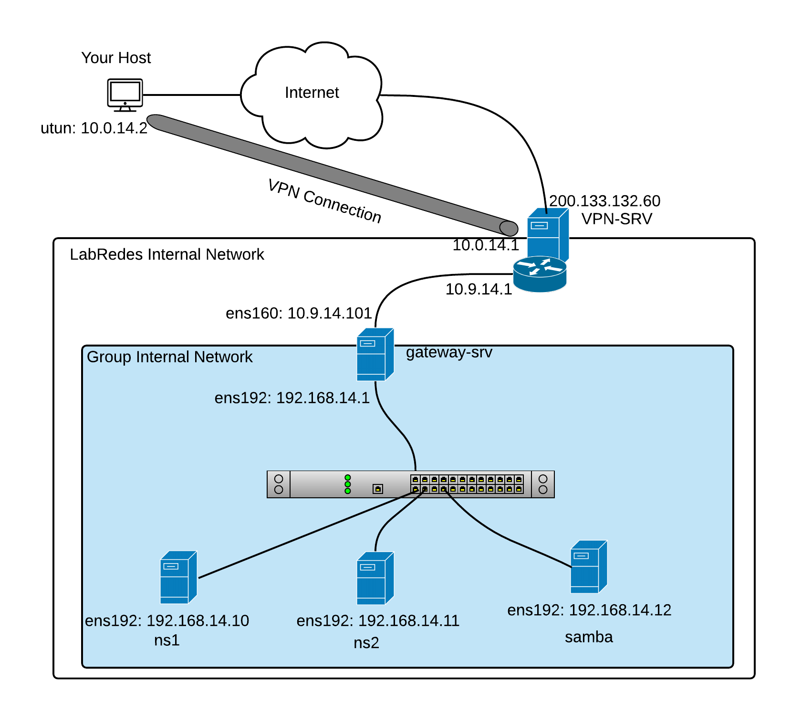

# Projeto Final da Disciplina de Serviço de Redes

   1. Criar um ambiente de rede virtualizado, no qual deve conter 4 máquinas virtuais com o S.O. Ubuntu Server.
   2. Criar um documento tutorial/roteiro contendo o passo-a-passo de configuração e execução de  um ambiente de rede virtualizada.
   3. Listar a configuração de hardware utilizada em cada MV. (Ex.: quantidade de memória, número processadores/cores, espaço em disco.
       -  Iremos utilizar as VMs individuais de cada aluno para compor o grupo de máquinas em rede.
   5. Endereçamento IP e nome do grupo será identificado pelo par nome-número do grupo (exemplo Grupo1), lembrando que o primeiro IP é o IP de rede, e o último é o IP de broadcast.
       - Criar uma tabela com as definições dos IPs das MVs com a máscara de rede /29 (255.255.255.248).
       - A Turma 914 usará a rede 192.168.14.0/24 para criar as subredes de grupos. 
       - A Turma 914 usará a rede 192.168.24.0/24 para criar as subredes de grupos. 
       - Exemplos:
          -- O Grupo 1 da turma 914 usará a faixa 192.168.14.[0-7]/29 
          -- O Grupo 4 da turma 924 usará a faixa 192.168.14.[24-31]/29 
          
   5. Criar uma tabela com as definições de domínio, com os nomes e endereços IP das MVs. 
       - O domínio deve obdecer ao formato: ```<grupoX>.<turma9yz>.ifalarapiraca.local.```
   6. Editar os hostnames com o nome de domínio no S.O. de cada MV.
   7. Em cada vm deve ter o usuário administrador e os usuários com os nomes dos integrantes do grupo. 
   8. Uma das MVs deve ser o [gateway server](https://github.com/alaelson/labredes2020/blob/570c163421c2b1a3cb0ff203525b1f683d41a189/network/nat/readme.md) do grupo, que deverá ter 2 interfaces rede (WAN e LAN)
   9. Um máquina deve conter o compartilhamento de arquivos com [SAMBA](https://github.com/alaelson/labredes2020/blob/5773a1b1da61a9baabeca6e6277e7dd05c12322b/network/samba/readme.md).
   10. As outras máquinas virtuais devem ter interface para a rede interna (LAN) configurada com o endereçamento ip de cada grupo.
   11. Duas MVs devem ser os servidores de nomes: nameserver1 (ns1) e nameserver2 (ns2).   
   12. Realizar a configuração do bind9 com o nameserver1 (master) e o nameserver2 (slave). A quarta MV deve ter o nome e o IP também registrado no servidor DNS   
   13. Colocar no tutorial os resultados todos os testes dos exercícios dos roteiros de NAT, DNS (master e slave) e do compartilhamento de arquivos com samba.

<p><center> Figura 1:  Topologia de Rede Virtualizada antes da execução do projeto.</center></p>   
   
       
<p><center> Figura 2:  Topologia de Rede Virtualizada depois da execução do projeto.</center></p>   
   
